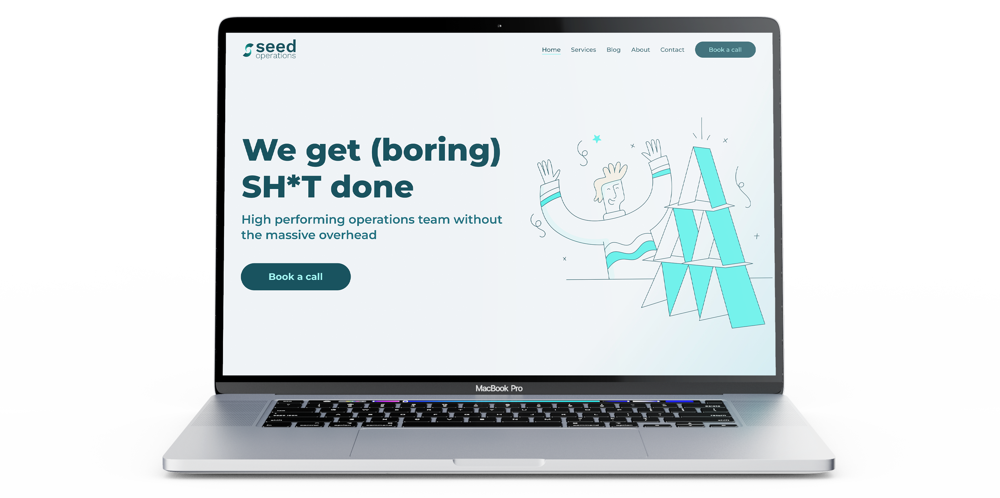
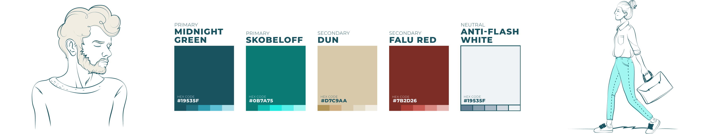
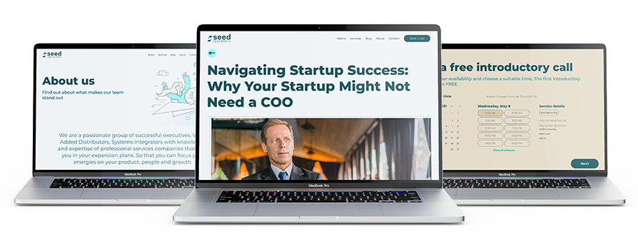

### Overview
Having worked alongside the core members of Seed Operations while they worked for Viveo, I was asked to help them to create a design solution for their new business. A company without any logo, brand assets, and a very basic original website, the company was quite early stages, although operating for a few years as a side-project for the team members, the aim was to make it a more established company offering services to help early stage start ups succeed.

### Problem
In order to succeed and stand out to cutting edge start-ups in Estonia, Seed Operations needed a brand and website that they could be proud of and help drive them towards success.

### Solution
Collaborating closely with the two key members of the Seed Operations team, I designed a logo, basic style guide and website that would surely get them noticed by their target audience. A WIX website was the preferred platform for the company.

---

### The process
In order to get to the main part of the project, a few elements needed to be taken care of first. A brand identity including logo, fonts, and colour palette were key to creating a website that fully represents the business. A collaborative effort, which required feedback sessions and fully understanding the likes and dislikes of the business owners was key to making this a successful project.

### Creating the brand
Firstly, it was all about the logo, finding the style of element that was required and suit the business. The icon element of the logo was created after multiple design reviews and consists of the idea of a seed that has sprouted, which represents the way the company helps you grow along with a hidden “s” in the whitespace.

Up next was finding the colours, font and image style that would set the overall tone of the website. A fun process, that went through some iterations on the font side especially, but was rather quick to complete. Take a look at some of the brand guide elements below.

### The website
As Seed Operations had the base structure for the site already created, there was no room for user testing on the website design and was mainly a focus on the UI elements of the site. The project consisted of multiple informative pages that easily connected with each other and an overall clean solution was required.

Having created the brand, I already had a clear vision in mind for the website, so it meant diving straight into hi-fidelity designs and making design improvements based on feedback in Figma to get the perfect solution for the client.

Overall, this was a quick process as I had a very strong understanding of the clients needs and a clear set of requirements on what to achieve.

