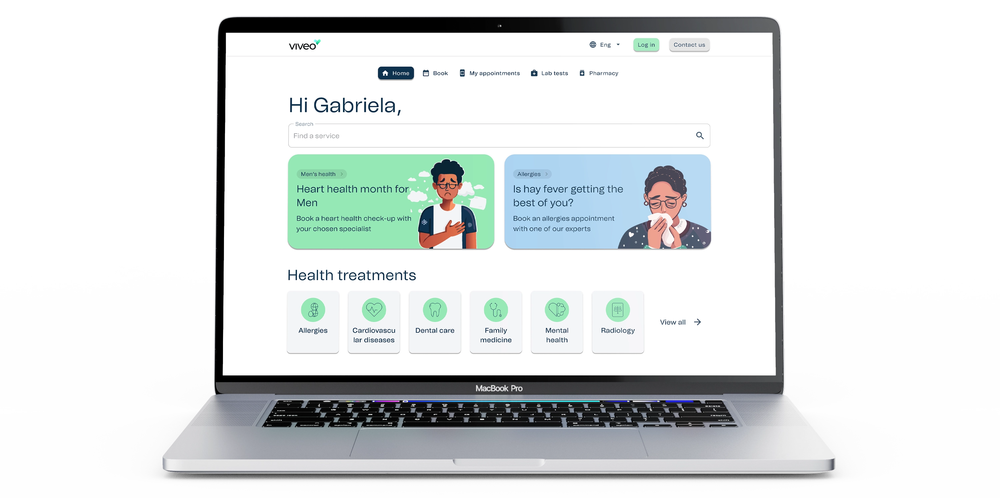
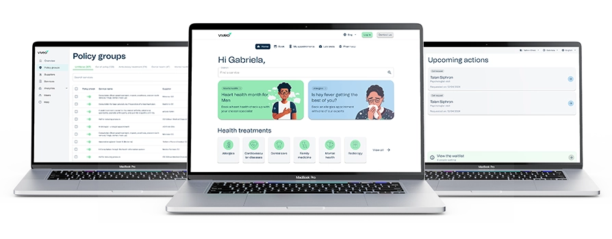
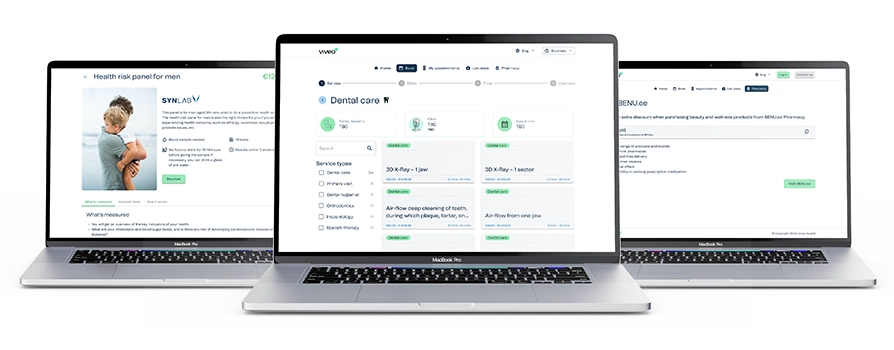
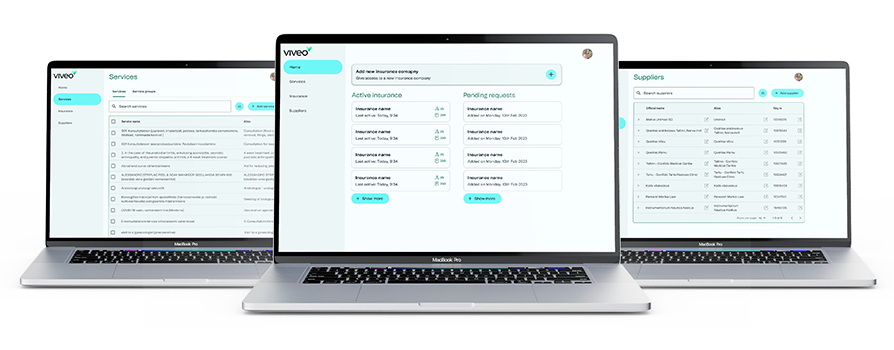
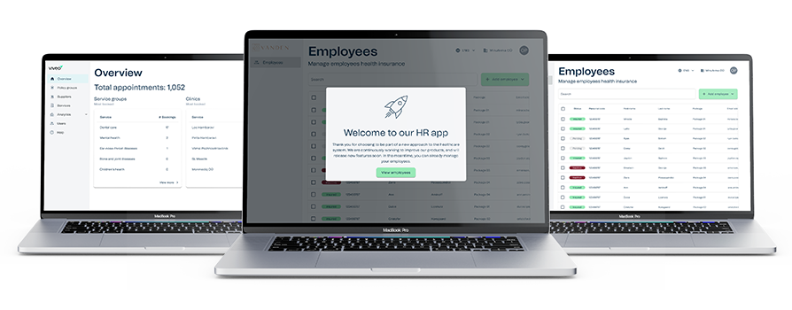

### Overview
Viveo is a health-tech company offering innovative solutions that connect insurance companies with healthcare providers while putting the patient at the forefront of the user journey. As lead designer I worked on designing the suite of products from an idea to an integrate suite of applications catering for different user needs across each app.

### Problem
Patients across Estonia are required to pay up front for services and then get reimbursed by the insurance company at a later stage, however, they don’t know if the service they are taking is going to be covered by their insurance company or if there are missing documents and if the healthcare service provider is an approved vendor of the insurer.

### Solution
The goal was to create a suite of applications that allows each party control their part of the journey.

For insurers, they will get a tool where they can easily say if a service is covered by a policy or not and control what the patient will see in their own whitelabel version of the patient portal.

For the clinic, a way of making services available for patients to book, keep track of payments and to also send the documents required by insurance companies to assist with claims.

Finally, for the patient, a place where everything becomes clear, what services the insurance company will cover, how much they need to pay up front for a service and an easy solution for submitting and tracking their claims.

---

### The process
As Viveo was transitioning to a new business model, this meant that the previous applications were no longer fit for purpose. A new suite of applications were required to be created from nothing. An idea based off of research into what the company had been offering but with a better market fit. The idea to become a SAAS company was being fulfilled with this new product suite but where to start.

The process set out from early on was to design the product, conduct user testing and build the best product that connects insurance companies with healthcare service providers.

### The first step – a new booking application
Firstly, the main reason to connect insurance companies and healthcare service providers is to provide a clear and seamless journey for patients. This meant a booking platform is required, and as Viveo was planning to be the software solution behind the products, the main focus was on the solution rather than how it looked. Overall, the patient facing application will be a whitelabel version with the insurance companies brand identity skin.

The core features of the booking portal were identified as:
- Service booking system
- Appointment management
- Lab test booking system
- ePharmacy integration

### Back office tools
Understanding the new focus of Viveo meant that there needs to be tools for Insurance companies and health service providers to be able to own what a patient can do in the patient application. Along with this, there needed to be a solution for Viveo to manage new insurance clients, health service providers and track data of all types of users. Knowing these are the next steps in creating the product suite and a lot of optimism to get it created quickly, it was time to dive in.

### We have the idea, what next?
As the new patient application was created off an understanding of what Viveo previously were developing, although the change in business direction to find better fortunes, we were able to utilise data and knowledge from the old business modal and application. However, with the back office tools, it was completely new territory. With no budget to recruit potential users, creating requirements for these tools was to become a more difficult task. As lead designer, I had to step into a position of figuring out these requirements from discussions with the wider business team.

We didn’t have a process in place and requirements were minimal, this project wasn’t leaning to a traditional approach to designing an application. The approach I was taking was unstructured but it was what I saw as the best fit for finding a way, and moving quickly to find the solution.

Ideas turned into hi-fidelity wireframes, as can be seen in the screens above, beautiful design wasn’t fully considered throughout this process, but a focus on what a user might need and how that fits into an application. These rapid design updates were complimented with design review sessions which were quite ad-hoc and sometimes turned into brainstorming sessions and gathering ideas based off the designs created. It became clear, that showing visuals to the business team, the knowledge of what the product needs to contain was there but needed to be massaged out of the team.

As a team, we got the product suite to a place where we could test on users, but finding those users was still difficult while our client list still remained quite low. The start-up lifestyle is a unique place to be, where traditional methods don’t always work and budgets are sometimes not what you would love them to be, we found a way to create a product to be happy about and user testing is currently ongoing to find improvements and shape the products more as Viveo’s client base grows.

---

### Conclusion
A challenging time for Viveo saw the creation of a new business model, a larger suite of products and a team growing together to achieve a lot for the company. Looking back on the project, there were a lot of key learnings for me that came from this project and gain a greater understanding to the business, managing a product, structuring design files, requests, and getting the exact information from the wider team to create a process for each individual project and gear it towards success. Some of my key learnings were:
- Being flexible and open to a change of ideas at the earliest stages of a project when the outcomes are still unknown is quite a good skill to have;
- Nothing will beat real life user feedback, however, if you don’t have that and need to reach goals, there are ways of making things work and always remember that once the idea is hashed out and something is created, you can always get the user feedback at a later stage;
- Working with other business units allows for a strong team collaboration along with gaining insights into what is really needed if requirements are unclear;
- Being a good listener is key, allow people to express their ideas, thoughts, keep track of them, evaluate the ideas and if they seem like they would work to improve the product or it needs to be further thought out;
- Enjoy the journey, there are many twists and turns but you need to embrace it, enjoy it and adapt to every scenario that might pop-up.