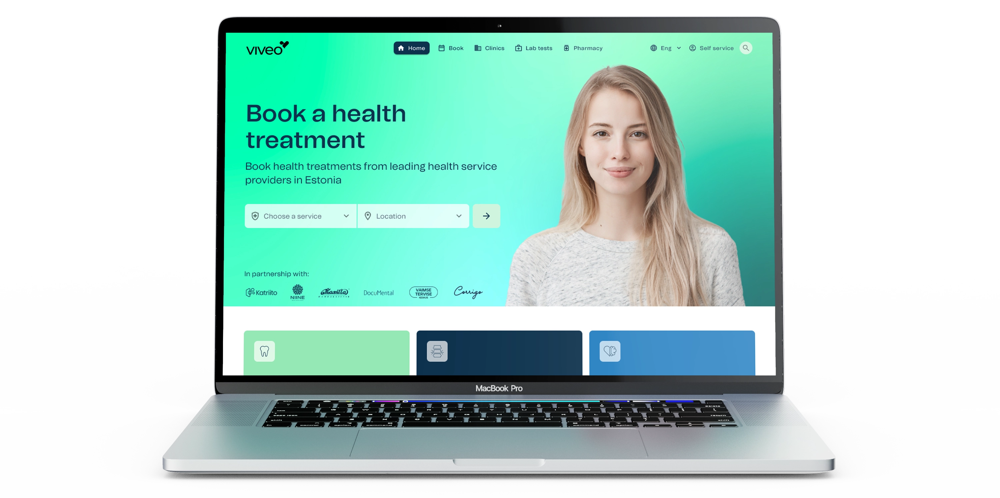
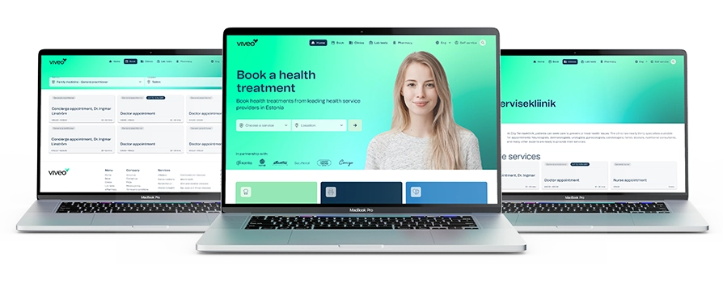
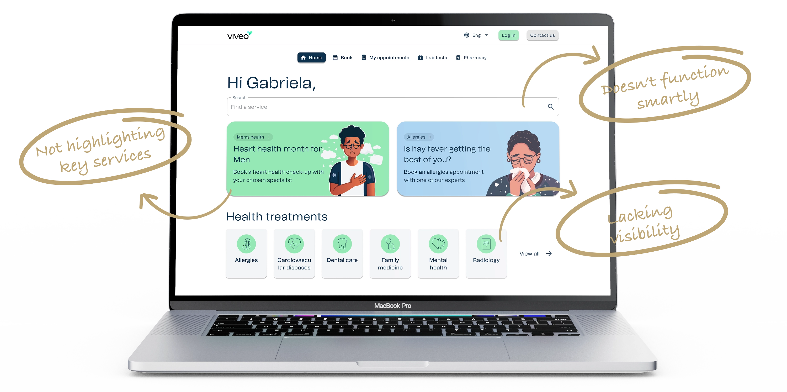
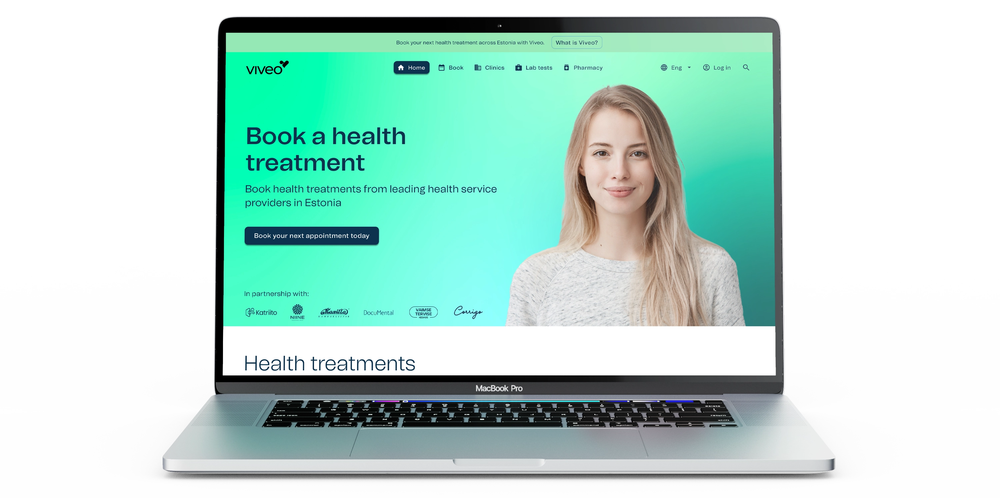
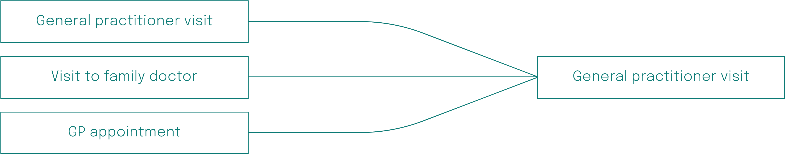
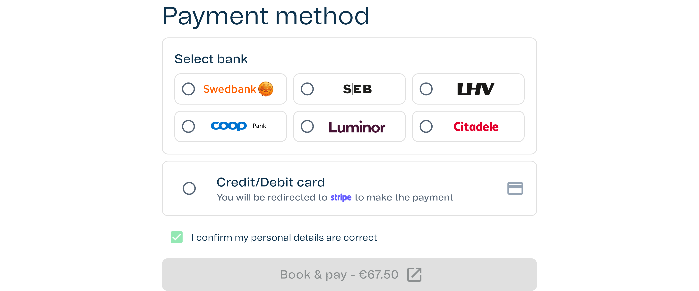
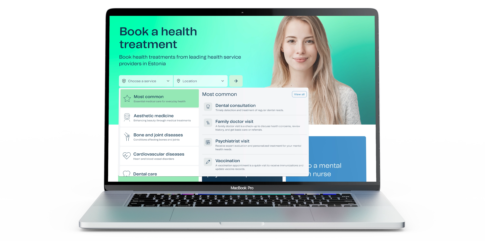

### Overview
Viveo is a health-tech company offering innovative solutions that connect insurance companies with healthcare providers while putting the patient at the forefront of the user journey. As Lead Designer and a core member of the product team, I guided the product’s evolution from concept to launch. Working closely with our CEO, Head of engineering and wider engineering team to design features for the product ecosystem.

### Problem
Patients across Estonia often struggle to efficiently discover alternative healthcare solutions and compare service prices across multiple providers, facing a time-intensive and research-heavy process that hinders accessibility and informed decision-making.

### Solution
The goal was to create an online booking platform that enables patients to precisely identify the services they need, explore available providers across Estonia, and access detailed pricing information in one convenient, user-friendly solution.

---

### The process
While having a B2B version of the product already made, the process began with launching the current version fo the product to the B2C market. Having conducted extensive usability testing on the B2B product previously, we felt it was the best first step in the process to gain real insights from actual live users.

[Read more about the B2B product](/case-studies/viveo-b2b)

After launching the B2B version of the product to the B2C market, our previous learnings from usability testing were put to the test and we gained valuable insights while using FullStory to capture user sessions in the background. This identified some key areas of improvement to the application and allowed me to focus on the key user pain points of the application.

With the aim of improving the process between product and engineering, I took it upon myself to liaise with a senior member of the engineering to come up with a way of working together that suits both teams and improve overall output. This lead to a greater understanding between both teams with better documentation and a phased approach for any new features or updates to current features.

It was key for Viveo as a business to be continuously updating the application to immediately improve usability, so each phase was released without running through usability tests, however, each update was monitored using FullStory to get real user samples to make continuous improvements, or if there is a need to change the later phases.

### Notable pain points
Although users were visiting the app, there was a notably low conversion rate which needed to be fixed. Identifying the issues the users were having were key to improving this. The notable points were:
- Users didn’t fully know what “Health treatments” were best for them
- When the user did know what “Health treatment” they wanted, they were left with an overwhelming choice of services with similar names and not knowing the differences
- Difficulties in finding a service that is close to the users location
- Lack of trust in the payment method as it differed from the main market payment solution
- Users don’t fully trust Viveo as they don’t know the company
See below a few areas identified as not functioning as strongly as they could be from the original B2B app.

### Phase 01 – Creating a functional identity
As the B2B application was created as mainly a whitelabel solution, it was important to give a stronger brand identity to the B2C portal which will start to give the user trust in the Viveo brand, along with sharing an introduction to “What is Viveo”.

Adding a “Hero” to the main landing page also gives Viveo the opportunity to create a statement and reassure users that they are in safe hands with Viveo. As healthcare is a very personal thing for everyone, it is important to create empathy with the user as they are viewing the app.

Another step to allow trust between the user and Viveo was to include an “In partnership with” section to showcase the larger health service providers who’s services can be booked on Viveo.

Removing the larger sections stated above as “Not highlighting key services” was a key move to improve clarity on the app during this phase and making updates to the “Health treatments” cards to allow them to stand out more.

### Phase 02 – Less decisions for the user
This phase mainly focuses on the user experience of booking a service. As healthcare service providers all have a different way of naming their services, there was a lot of repetition throughout the service selection screen. To tackle this, I worked closely with our co-CEO (who also lead product) to come up with a solution that reduces that overwhelming feeling users were experiencing.

This solution combines all similar services as one with the choice of which service provider the user wants to go to at the next screen. This means that there are more choices for the user on the “Clinic selection” screen, but they are able to see what locations they are offered and make a more informed decision that works for them at this stage in the booking flow.

### Phase 03 – More ways to pay
Taking into consideration that in Estonia, the common way to make payments is directly through bank links, it was important to add this payment method into the application as soon as we made minor improvements to the booking flow.

### Phase 04 – Making some key services more visible
Having checked over the screen recordings from FullStory, it was clear that there was still some difficulties for users to find the key services in the app. Identifying that there are three key healthcare services based on the business conversations’ with healthcare service providers, it is important to make them even easier to find for users. This phase meant to re-introduce the section that was in the earlier B2B app with some updates.

### Phase 05 – Conversion is better but users still struggle
Feedback from users was that they were struggling to find services in a location that suited them, and also struggled with what services they needed to book. This meant a revisit to the new hero section and making a key update to the feature. I took this on myself to come up with a much stronger, easy to use solution that users might be familiar with. After some research, it was apparent that the users needed a more functional search style booking form. Upon launch of this new update, there was a high increase in conversions on the application and the FullStory recordings backed up with evidence that the new hero update was a key reason for the increase in conversions.

---

### Conclusion
As with every living product, this application has ongoing updates and improvements required to meet the users needs. However, the journey from the start of the product until the latest phase thought me a lot about many different things:
- User testing products and features is important, however, it doesn’t always have to be done pre-launch. Having a mentality of shipping the product fast, the analytical tools in place and a strong knowledge of how to act as product owner and product designer to make the right decisions to improve a live product.
- It’s great to create a strong working relationship with other teams, as mentioned above finding the best solution with the engineers to ensure a smooth handover and expectations between both business units.
- Planning is key, keeping people up to date is even more key, but having the ability to pivot and switch things up throughout a project is a must to ensure that you are creating a product that fully reflects the users needs.